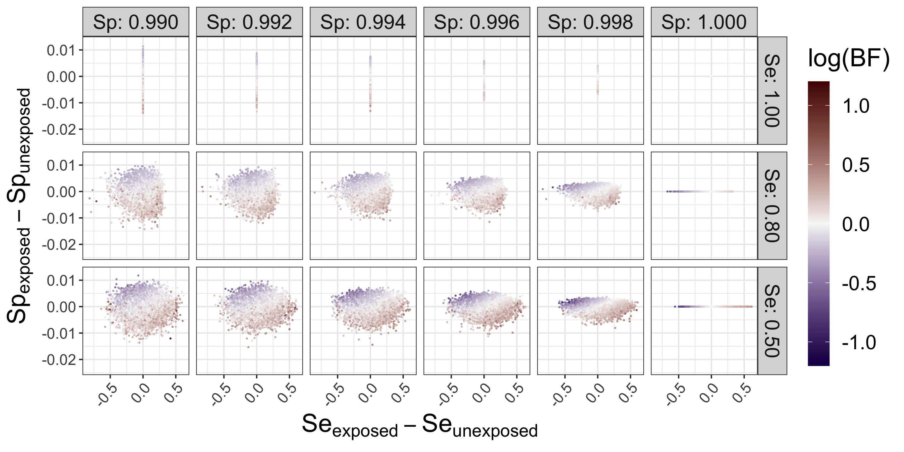
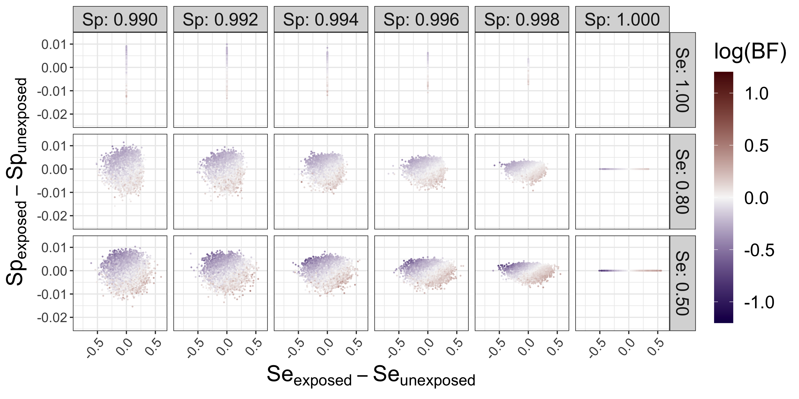
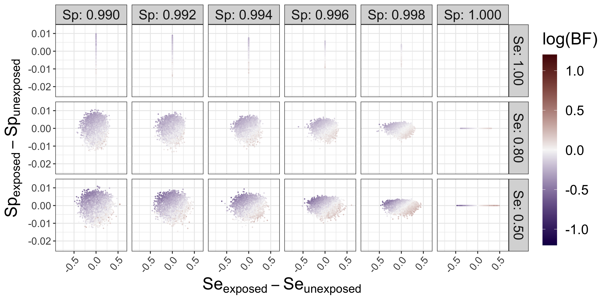
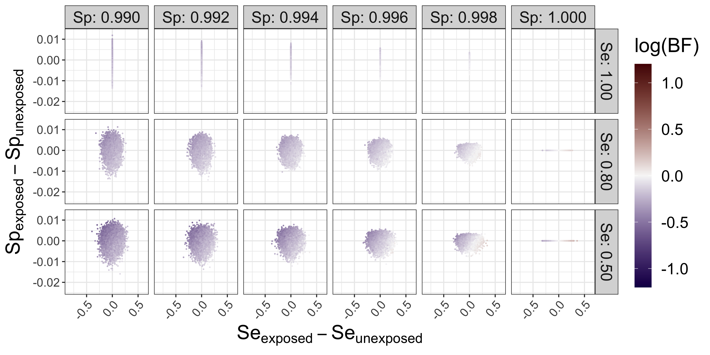
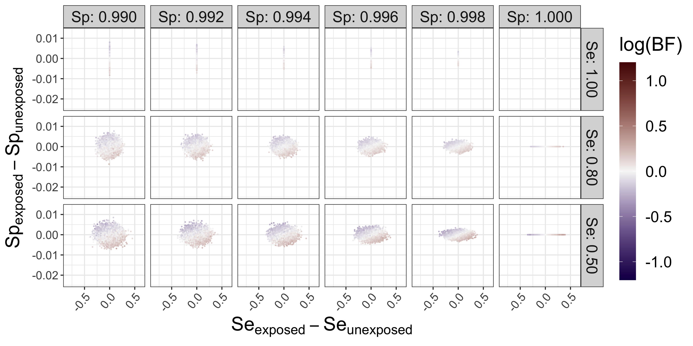
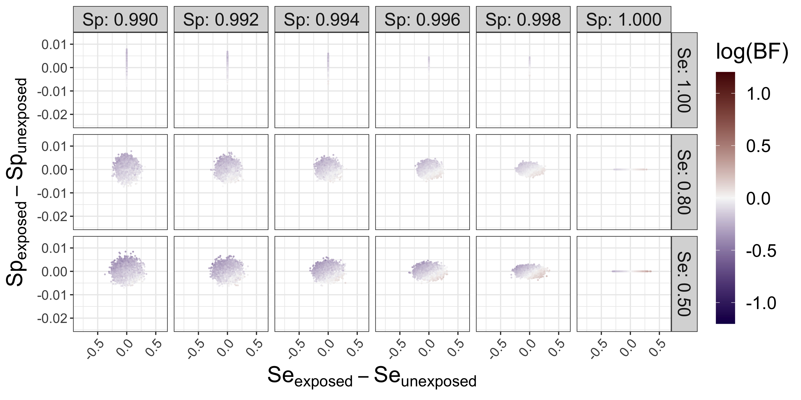
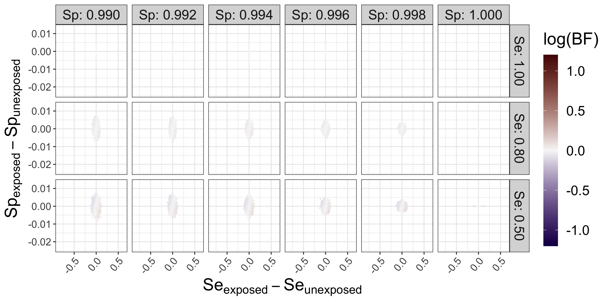

```{r setup, include=FALSE}
knitr::opts_chunk$set(echo = TRUE)
knitr::opts_knit$set(root.dir = "/Users/02tahern/OneDrive - UVM Larner College of Medicine/projects/ndmd-sim/results/analysis/output/deltascat")
```

```{r eval=FALSE, include=FALSE, results='asis'}
files <- list.files(pattern="*.png", full.names=TRUE)
for (f in files) {
  cat(paste0("\n"))
  }
```

## Exposure prevalence = 0.1 | Risk in unexposed = 0.01

### True RR = 1



### True RR = 1.5


### True RR = 2


### True RR = 5


## Exposure prevalence = 0.1 | Risk in unexposed = 0.10

### True RR = 1


### True RR = 1.5


### True RR = 2


### True RR = 5


## Exposure prevalence = 0.5 | Risk in unexposed = 0.01

### True RR = 1


### True RR = 1.5


### True RR = 2


### True RR = 5


## Exposure prevalence = 0.5 | Risk in unexposed = 0.10

### True RR = 1


### True RR = 1.5


### True RR = 2


### True RR = 5
